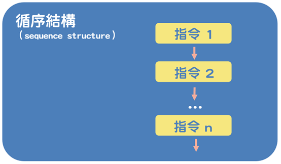
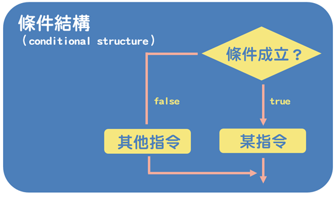

## 程式設計步驟

1. 需求認識

   了解程式所要解決的問題是什麼，並且搜集所要提供的輸入資訊與可能得到的輸出結果

1. 設計規劃

   根據需求，選擇適合的資料結構，並以任何的表示方式寫一個演算法以解決問題

1. 分析討論

   思考其他可能適合的演算法及資料結構，最後再選出最適當的標的

1. 編寫程式

   把分析的結論，利用程式語言寫成初步的程式碼

1. 測試檢驗

   最後必須確認程式的輸出是否符合需求，這個步驟得細部的執行程式並許多相關測試與除錯

## 注意事項

- 適當的縮排
- 明確的註解
- 有意義的命名
- Debug
  - 語法錯誤(無法編譯)
  - 邏輯錯誤(可編譯，結果無法預期)
  - 執行期間錯誤

## 結構化程式設計

- 循序結構

  逐步的撰寫敘述

  

- 選擇結構

  依某些條件做邏輯判斷

  

- 重複結構

  依某些條件決定是否重複執行某些敘述

  
